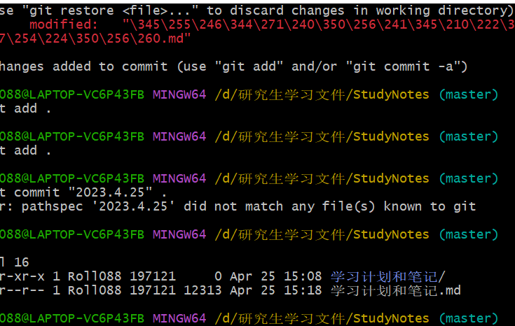

# →


# 近期

从上到下 按照 **优先级** 排列

flowable

springcloud

zookeeper


**上午4h（2h英语，2h学习）   下午7h  晚上2h运动**

8-10 （2h）英语                                                                 8:00-8:40单词	8:40-9:20阅读    9:20-10:00听力


10-12（2h）学习（flowable）


12-13（1h）吃饭休息

13-14 自由时间   做计划 背单词 


14-16（2h）学习（zookeeper）

16-18（2h）学习（springcloud）

18-20（2h）学习（flowable）


20-22健身运动

## 英语

### 尚雯婕方法：

找视频，一个字一个字查字典，听写下来，直道背到跟支持人语速一样快为止，十片

找视频

先看看一遍视频

把文字抄下来，弄明白文章意思

无字幕一句句听，把英语写下来，听到结尾

背诵 直道 能和主持人语速一样

### 六级笔记：

单词&短语：听力的记在b站笔记里，能快速找到出处，阅读的记在原文处

听力：不对听力原文，找关键词，如何做对题

阅读：做题限制时间，对答案分析，总结会出题套路

写作翻译：模板

|               | 计划时间 | 实际时间 | 时间差 |                                         |           |
| -------------------- | ---- | ---- | -------------------- | -------------------- | -------------------- |
| 作文+听力预读 | 30 min   | 25+5 min | 0 |  | 共106.5分 |
| 听力          | 30 min   | 30 min   | 0      | 7.1分/题  共15题<br />14.2分/题  共10题 | 共248.5分 |
| 阅读          | 20 min   | 30 min | -10  | 14.2分/题  共10题                       | 共142分   |
| 翻译          | 30 min   | 25 min   | 5      |  | 共106.5分 |
| 长篇阅读 | 10 min   | 15 min | -5 | 7.1分/题  共10题                        | 共71分 |
| 选词填空 | 10 min   | 10 min | 0    | 3.55分/题  共10题                       | 共35.5分  |
| 共 | 130 min | 140 min | -10 | | 710分 |

### 六级进度：

| 年份         | 听力 |      |
| ------------ | ---- | ---- |
| 2021.6（1）  | 1:24 |      |
| 2021.6（2）  |      |      |
| 2021.6（3）  |      |      |
| 2021.12（1） |      |      |
| 2021.12（2） |      |      |
| 2021.12（3） |      |      |
| 2022.6（1）  |      |      |
| 2022.6（2）  |      |      |
| 2022.6（3）  |      |      |

#### 听力：

[听力链接](https://www.bilibili.com/video/BV1JA411N7sk?p=5&vd_source=3d275c15df5bb27a0e7c2d0667ad260d)

[听力笔记 b站笔记链接](https://space.bilibili.com/v/note-list)

## flowable（进行中）

[flowable快速入门](https://www.bilibili.com/video/BV1fa411j7Q5/?vd_source=3d275c15df5bb27a0e7c2d0667ad260d)（完成）

19:35  4.13


[波哥Flowable工作流最新教程](https://www.bilibili.com/video/BV1PY411F7ir?p=20)

29   2023.4.23

33    2023.4.24

### 笔记

@before

@Before 注解所标注的 方法 会在每个 测试方法 之前 被自动调用


```
部署流程涉及到三张表：
流程部署表：ACT_RE_DEPLOYMENT 一次流程部署操作就会生成一张表结构
流程定义表：ACT_RE_PROCDEF  一次部署操作中包含几个流程定义文件就会产生几条记录
流程定义资源文件表：ACT_GET_BYTEARRAY  有多少资源就会生成几条记录
```

```java
// 1.获取 ProcessEngine 对象，自动获取resource文件下的flowable.cfg.xml文件链接数据库
ProcessEngine processEngine = ProcessEngines.getDefaultProcessEngine();
```


## springcloud（进行中）

[黑马springcloud](https://www.bilibili.com/video/BV1LQ4y127n4/?spm_id_from=333.999.0.0&vd_source=3d275c15df5bb27a0e7c2d0667ad260d))

5  4.13  （没连接上数据库，报错）

## gpt语音（进行中）

### 计划

***在ubuntu虚拟机上运行成功在放到机器人里***


openai代理  [腾讯云函数1分钟搭建 OpenAI 国内代理 - 知乎 (zhihu.com)](https://zhuanlan.zhihu.com/p/612576046)

chatgpt逐字播放

本地  语音转文字

本地  文字转语音

机器人回答之后，立刻开启麦克风这段时间   缩短

循环对话功能没了


## spark（进行中）

[黑马spark](https://www.bilibili.com/video/BV1Jq4y1z7VP/?spm_id_from=333.337.search-card.all.click&vd_source=3d275c15df5bb27a0e7c2d0667ad260d)

MLlib内置机器学习api和GraphX图计算api

8  2023.5.5


<<<<<<< HEAD


## 黑马瑞吉外卖（暂停）

[视频链接](https://www.bilibili.com/video/BV13a411q753/?p=2&spm_id_from=pageDriver&vd_source=3d275c15df5bb27a0e7c2d0667ad260d)

5  4.23
=======
>>>>>>> 2207a15b426afd947d9971f38bc980ccb2f8cceb

### 笔记

gpt定期有次数限制


[链接](https://www.bilibili.com/video/BV1aN411w7iB/?spm_id_from=333.788&vd_source=3d275c15df5bb27a0e7c2d0667ad260d)

3 5.6

3 5.7（文字转音频不成功）

5 5.8 （语音识别用外网的，不用百度的，不翻墙用不了gpt，翻墙了又用不了语音识别）

## pycharm


|                          |              |
| ------------------------ | ------------ |
| env\Scripts\activate.bat | 进入虚拟空间 |
| pip list -v              | 查看所有包   |
| pip show <包名>          | 查看该包     |
| deactivate               | 退出虚拟环境 |
|                          |              |

​             

## Linux指令


|                |             |
| -------------- | ----------- |
| 重启           | sudo reboot |
| 快速打开控制台 | ctrl+alt+t  |
| 切换至root     | sudo su -   |


## springboot（暂停）

***学完可以找一些实战项目，类似学习solidworks时候也是，学完进行实战，然后实战多了就知道咋搞了***

[尚硅谷springboot](https://www.bilibili.com/video/BV19K4y1L7MT/?p=2&spm_id_from=pageDriver&vd_source=3d275c15df5bb27a0e7c2d0667ad260d)

5 3.28

20  19:22 3.29

23 2:09 3.30

32 3.31（把boot-05-web-01这个moudle重新看一遍，重新做一遍 23集开始）

———————————————————————————————————————————————————————————————————————————————————————

[黑马springboot（完成）](https://www.bilibili.com/video/BV1Lq4y1J77x/?spm_id_from=333.337.search-card.all.click&vd_source=3d275c15df5bb27a0e7c2d0667ad260d)

第17个视频有bug，但是比较独立可以先不搞

16 4.3

23 4.4

27 4.7

34 4.10


###  笔记


### lombok插件

lombok的@Data注解自动生成get set方法

lombok的@Tostring注解 **编译时**自动生成tostring方法

lombok的@NoArgsConstructor注解 自动生成无参构造方法

lombok的@AllArgsConstructor注解 自动生成全参构造方法

lombok的@Sl4j注解 自动给类里面注入log属性

Log.info（"请求进来了。。"），进入这个页面时候控制台打印"请求进来了。。"


### yml/yaml语法

#### yaml数据格式

- 对象（map）

  ```yml
  person:
  name: zhangsan
  
  # 行内写法
  person: {name: zhangsan}
  ```

- 数组

  ```yml
  address:
  - beijing
  - shanghai
  
  # 行内写法
  address: [beijing,shanghai]
  ```

- 纯量，不可再分的值

  ```yml
  msg1: 'hello \n world' # 单引忽略转义字符
  msg2: "hello \n world" # 双引识别转义字符
  
  ```

#### yaml参数引用

```yml
name: lisi

# 引用上边定义的name值 用${  } 
person:
name: ${name} 

```

### 注解

#### @Value

用@Value注解调用配置文件yaml的内容

```java
//用@Value注解调用配置文件yaml的内容
@Value("${name}")
private String name;

```

#### @Autowired 

用@Autowired 注解 自动调用配置文件yaml的内容，**定义一个Environment 对象**

```java
@Autowired
private Environment env;

@RequestMapping("/hello2")
public String hello2(){
    System.out.println(env.getProperty("name"));
    System.out.println(env.getProperty("person.age"));
    System.out.println(env.getProperty("address[0]"));

    return "Hello SpringBoot !";
}
```

#### @Value

用@Value注解调用配置文件yaml的内容

```java
//用@Value注解调用配置文件yaml的内容
@Value("${name}")
private String name;
```

#### @component

在类上面添加@component注解，标识这一个bean

#### @ConfigurationProperties

在类上面加@ConfigurationProperties，在配置文件中找和这个 类的属性名字一样 的属性的内容

@ConfigurationProperties(prefix = "person")

这样可以在配置文件中寻找person对象，在再对象的属性中寻找和 这个类属性名字一样的属性，并把内容注入给这个类

#### @RestController

在类上添加@RestController使得类成为一个控制器

下面的

#### @RequestMapping("/hello")

一个通用的请求映射注解，("/hello")是在网站上后面添加的地址，进入之后能得到这个方法返回的内容

#### @RunWith(SpringRunner.class)  &  @SpringBootTest()

@RunWith(SpringRunner.class)和@SpringBootTest()通常一起写

在一个类上面添加@SpringBootTest()，表明这个类是一个测试用类


#### @Configuration & @Bean

@Configuration用于标识这个类为配置类，其内部的方法使用@Bean注解定义Bean。当Spring应用程序启动时，会自动扫描@Configuration注解的类，并且执行其中所有带有@Bean注解的方法，将这些方法所返回的对象注册到Spring容器中。这样的话，在应用程序的其他地方可以直接通过@Autowired注解来注入这些对象。


## zookeeper（暂停）

[尚硅谷zookeeper](https://www.bilibili.com/video/BV1to4y1C7gw/?vd_source=3d275c15df5bb27a0e7c2d0667ad260d)


## ssm（暂停）

[【尚硅谷】SSM框架全套教程，MyBatis+Spring+SpringMVC+SSM整合一套通关_哔哩哔哩_bilibili](https://www.bilibili.com/video/BV1Ya411S7aT/?spm_id_from=333.337.search-card.all.click&vd_source=3d275c15df5bb27a0e7c2d0667ad260d)

9 9.22

11  9.23

21  9.26

21（把工程从新做一遍）  9.27

25 （15个视频）    9.28

29 10.6

14  3.8

36 3.9

46 3.10

52  3.17

66 3.20

67 5:30 3.21

91 3.23、

93 3.24

102 3.27


## git（完成）

03 3.21

22 3.22

看完了github 没看gitee

### 笔记

在.git下执行以下操作

git init                                              初始化

git add .                                           添加到暂存区

git status                                         查看本地库状态

git commit -m "日志信息" 文件名

git push origin master                  推送

git pull 别名 分支名称                    拉取

git remote                                      查看仓库名字

git remote -v                                 查看当前所有远程地址别名

git remote add 别名 远程地址        eg：git remote add ori https://github.com/atguiguyueyue/git-shTest.git


#### 拉一个项目

git init                                              初始化

git remote add 别名 远程地址

git pull 别名 分支名称


#### push更新一个项目

git add .                                           添加到暂存区

git commit -m "日志信息" 文件名

git push origin master                  推送


#### 不小心把.idea给push了

解决办法：github上删除.idea文件，本地pull，再push就好了

注：pull时候**本地的.idea也会删除**，但是这个文件夹可以自动创建


## docker（暂停）

[尚硅谷Docker实战教程（docker教程天花板）]([03_docker理念简介_哔哩哔哩_bilibili](https://www.bilibili.com/video/BV1gr4y1U7CY/?p=3&spm_id_from=pageDriver&vd_source=3d275c15df5bb27a0e7c2d0667ad260d))

19   3.1

23  3.2

34 3.5

57 3.6

58 3.7

63 （没学过springboot springcloud）3.8

## hadoop（暂停）

07  9.1

17 9.6

21 9.7

23 9.8

26 9.13

28 4:00 9.14 

34   9.15

38 9.16

（一天至少10个视频 10.1之前看完  必须！！）

46（--48）  4:21   9.18

59（20号 看完视频 其余时间看看springboot 和 ks8关系啥的） 9.19

70 （21日完成10个hadoop视频） 9.20

74 9.21

74 9.22

74 9.23

78 9.26

88 9.27

88 （12个视频） 9.27

98 11.7

105 11.9

122 11.10

124 5:16 1.6

125 1.9

127 1.10

138 2.23

143 2.27（后面是更详细的参数相关，也不多，但是进度紧张，先不看，需要的时候看）


## mysql

查看所有数据库 情况

show database 


查看是否有这个数据库

SELECT COUNT(1) FROM information_schema.tables WHERE table_schema = '库名'     返回值0则不存在  1为存在


## 尚硅谷云原生 (暂停）

之后跟视频一样用云服务器从头做

[06、云平台-按量付费优点_哔哩哔哩_bilibili](https://www.bilibili.com/video/BV13Q4y1C7hS?p=6&spm_id_from=pageDriver&vd_source=3d275c15df5bb27a0e7c2d0667ad260d)

9  9.30

19  10.4

32  （19-22未看  明天嗑完）   10.5

35 7:49(ip地址为啥不行？  需要修改？？) 10.7

37（写完jupyter和工程伦理） 10.8

49 10.10

57 10.19  （删除命名空间  然后重新部署）

———————————————————————————————————————

p57 ingress一直在创建，估计是网段原因，修改之后重新部署，没有pod，删除命名空间也一直在卡，先放弃了  

​																																	10.20

——————————————————————————————————————

## 华为云原生（暂停）

1.2 10.11

题库蓝色的那块   10.20


最后考试机会没了


## javaweb看黑马


## k8s


## hive

## Hbase

## GO语言？？


## 注意

学java 做笔记

## 研一上

### 找同门问

学啥   

课题组研究方向

老师做什么

传承项目

看论文？

Python还是java

奖学金评定

### 查

同门论文

看招聘网站的需求

开源项目

## 学

java se 

mysql 

xml


